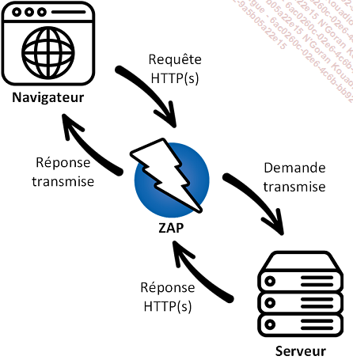
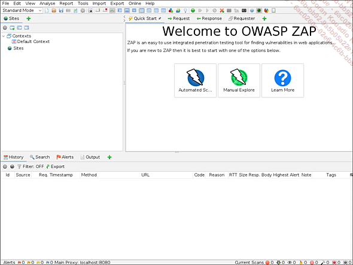

# Outil d’analyse web (OWASP ZAP)
## Présentation de l’outil
OWASP Zed Attack Proxy (ZAP) est un outil open source développé par l’OWASP. Il est conçu pour aider à trouver les failles de sécurité dans les applications web. 

## Installation et configuration
1. Installation d’OWASP zap
##### Étape 1 : Téléchargement
>  Rendez-vous sur le site officiel d’OWASP zap : `https://www.zaproxy.org/download/.` 
> Téléchargez la version appropriée pour le système d’exploitation utilisé.
 
 ##### Étape 2 : Installation

> Windows : Exécutez le fichier `.exe` téléchargé.
Suivez les instructions de l’assistant d’installation.

> macOS : Ouvrez le fichier `.dmg ` et glissez l’application dans le dossier Applications.

> Linux : Téléchargez le package correspondant ou utiliser un gestionnaire de paquets si disponible. Sinon, téléchargez la version portable et exécutez le script `zap.sh`.

#### Étape 3 : Lancement de l’Application

*  Lancez OWASP zap.

2. Configuration du navigateur pour utiliser OWASP zap
#### Étape 1 : Configuration du Proxy

 Configurez le navigateur pour utiliser 127.0.0.1 comme proxy http/s sur le port utilisé par zap (par défaut 8080).

> Avec Mozilla Firefox 
Ouvrir `Paramètres`, dans `Général → Paramètres réseau → Cliquez sur Paramètres…`
Sélectionner `Configuration manuelle du proxy`
Renseigner :
`Proxy HTTP : 127.0.0.1`
`Port : 8080`
Cocher `Utiliser ce proxy pour tous les protocoles`
Valider avec `OK`

> Avec Google Chrome
Ouvrir `Paramètres → Réseau et Internet,→ Cliquez sur Proxy…`
Activer `Utiliser un serveur proxy`
Renseigner :
`Adresse : 127.0.0.1`
`Port : 8080`
Cocher `Utiliser ce proxy pour tous les protocoles`
Valider avec `Enregistrer`

#### Étape 2 : Importation du Certificat CA de ZAP

*  Dans OWASP zap, allez dans `Outils - Options - Certificat dynamique ssl.`
*  Cliquez sur `Générer `si aucun certificat n’existe, puis sur `Exporter`pour enregistrer le certificat.

* Importez le certificat dans le navigateur.

## Utilisation pratique
#### Scans automatisés
Voici les étapes pour lancer un scan automatisé :

* Configuration de la cible : dans l’onglet `Sites`, ajoutez l’URL de la cible. (Utilisez un site web dont vous avez l'autorisation (ex: http://scanme.nmap.org/) ou qui est hébergé sur votre ordinateur !)

* Démarrage du scan :

  ==> Sélectionnez la cible, puis cliquez sur le bouton `Attack`
  ==> Choisissez le type de scan (`rapide ou approfondi`). 
  
* Analyse des résultats :

  ==> Les alertes et les vulnérabilités détectées apparaissent dans l’onglet `Alerts`.

#### Interception de requêtes
* Configuration du Proxy
S’assurer que le navigateur est configuré pour utiliser le proxy de l’outil.

* Interception avec OWASP ZAP

==> Activation de l’intercepteur :

- [x]    Utilisez le mécanisme de `breakpoints` :  `Tools - Breakpoints` ouvre le panneau de gestion des breakpoints.

- [x] Dans ce panneau, activez `Request Breakpoints`  et/ou  `Response Breakpoints (you can set conditions such as URL, method, or header)` .

- [x] Alternativement, dans l’onglet `Breaks`   (ou ` Breakpoints`  selon la version), cliquez pour activer/désactiver l’interception globale.

* Interception des requêtes :

==> Naviguez sur le site cible.

==>  Les requêtes apparaissent dans l’onglet  `Break | Breakpoints`   ou (selon la version UI) dans  `Automated Scan | Active Scan`    .

* Modification des requêtes :

==> Modifiez les détails de la requête.

Cliquez sur   `Continue` pour envoyer la requête ou   `Step` pour avancer pas à pas.

* Analyse des résultats
###### Interprétation des Alertes

* Catégories de vulnérabilités :

==> Les vulnérabilités sont classés par sévérité (faible, moyenne, élevée).
==> Chaque alerte comprend une description, l’impact que peut avoir la vulnérabilité, et des recommandations.

* Détails techniques :

==> Description : comprendre la nature de la vulnérabilité.

==> Preuves : exemples de requêtes/réponses illustrant la vulnérabilité.

==> Solution : conseils pour corriger le problème.
###### Génération de Rapports

OWASP zap :

* Allez dans `Rapports - Generate Report` .

* Sélectionnez le format (HTML, XML, Markdown).

###### Utilisation des rapports

* Les rapports peuvent être partagés avec les équipes de développement pour corriger les vulnérabilités.

* Ils servent de documentation pour les audits de sécurité.